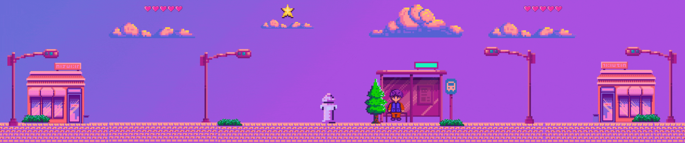

<!-- README de Jose David Carranza Angarita -->

<!-- Importar fuente retro estilo videojuego -->
<div align="center">
  <h1 style="font-family: 'Press Start 2P', cursive; font-size: 20px;">
    Hello, I'm 
    <a href="https://jose-david-carranza-unity-developer.netlify.app/" target="_blank">
      JosedavdMast3r
    </a> 👾
  </h1>

  

</div>

```csharp
using UnityEngine;

public class PlayerController : MonoBehaviour
{
    string message = ">> \"El mundo siempre necesita héroes.\" — Overwatch";

    void Start() 
    {
      Debug.Log("Developer mode on");
      Debug.Log(message);
    }
}
```

### 🛠️ Tecnologías

[](https://skillicons.dev)

### 🛠️ IDE y Herramientas  

[](https://skillicons.dev)

### Sigueme

[](https://youtube.com/@josedavidcarranzaangarita?si=DT2QzBvZP6IB1IRo)

[](https://discord.com/channels/@me)

[](https://www.linkedin.com/in/jose-david-carranza-angarita-unity-developer/)

### 📊 GitHub Stats

<p align="center">
  <a href="https://github.com/josedavd-07">
    
    
  </a>
</p>

<!-- Importar fuente retro estilo videojuego -->
<div align="center">
  
</div>